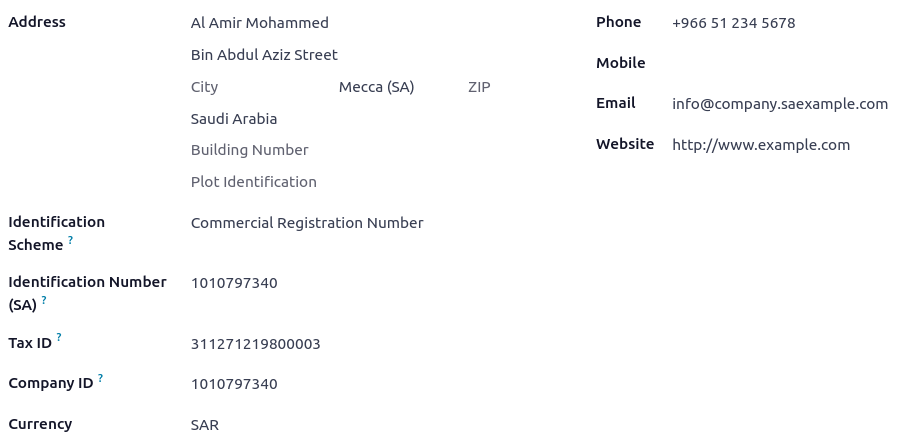
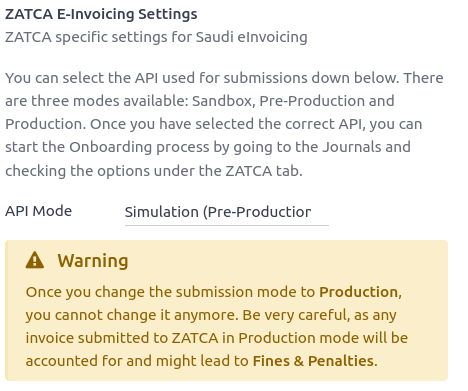
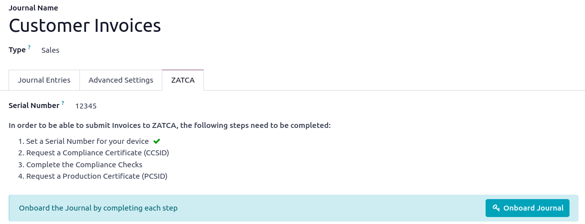
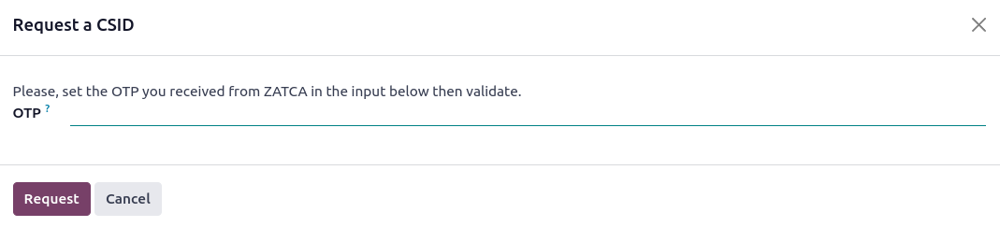
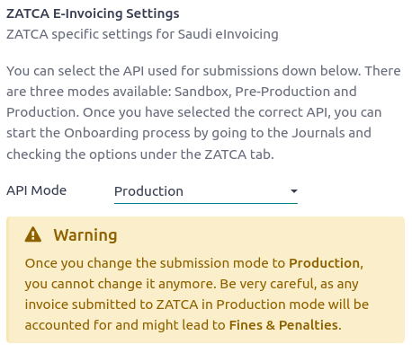
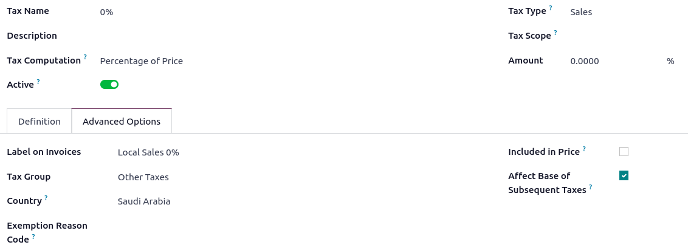

============
Saudi Arabia
============

Configuration
=============

:ref:`Install <general/install>` the following modules to get all the features of the Saudi Arabian
localization:

.. list-table::
   :header-rows: 1
   :stub-columns: 1

   * - Name
     - Technical name
     - Description
   * - Saudi Arabia - Accounting
     - `l10n_sa`
     - Default :ref:`fiscal localization package <fiscal_localizations/packages>`
   * - Saudi Arabia - E-invoicing
     - `l10n_sa_edi`
     - E-invoice implementation
   * - Saudi Arabia - E-invoicing (Simplified)
     - `l10n_sa_edi_simplified`
     - ZATCA, E-Invoicing, support for Simplified Invoices

Company information
-------------------

Configuring the company's information ensures the Accounting database is properly set up. To add
information, go to :menuselection:`Settings --> General Settings`, and in the :guilabel:`Companies`
section, click :guilabel:`Update info`. From here, fill out the fields:

- :guilabel:`Company`: full company name
- :guilabel:`Address`: the address of the company;
- :guilabel:`Identification Scheme`: company's identification scheme;
- :guilabel:`Identification Number`: Company identification's number;
- :guilabel:`VAT number`: VAT of the company;
- :guilabel:`Company Currency as SAR`: currency needs to be set as SAR.

E-Invoicing
===========

The Zakat, Tax and Customs Authorities (ZATCA) is the main regulating authority in Saudi Arabia for
customs and other taxes. Its portal facilitates numerous services for taxpayers.
If a company is already registered with ZATCA, it should then dispose of a username and a password
ready to be used for logging in Fetoora portal.

In Odoo, it is necessary to choose the :guilabel:`ZATCA API Integration` mode. To do so, go to
:menuselection:`Accounting --> Configuration --> Settings --> ZATCA API Integration.`
There are three modes to choose from:

- :guilabel:`Simulation (Pre-Production)`
- :guilabel:`Production`
- :guilabel:`Sandbox`

.. important::
   Ensure you are initially accessing the :guilabel:`Simulation` mode so that testing is not
   reflected on the actual platform. This step allows the flexibility to test invoicing workflows
   from different aspects without holding responsibility for the testing invoices.
   Once in :guilabel:`Production` mode, it cannot be changed anymore. Any invoice submitted to ZATCA
   in production mode will be accounted for and might lead to fines and penalties.

.. _saudi/journals:

Journals setup
--------------

For each :guilabel:`sales Journal` used on Odoo, a new device needs to be onboarded. Each journal
results in one OTP from the Fetoora simulation portal.

.. note::
   It is common to use one :guilabel:`Journal` for each branch or shop.

A serial number must be assigned for each journal; the number needs to be unique for each company.
To do so, go to :menuselection:`Configuration --> Journals`, open the :guilabel:`Customer Invoice`
journal, and in the :guilabel:`ZATCA` tab, the journal can be onboarded.

When clicking :guilabel:`Onboard Journal`, you can paste the OTP received from the Fatoora
portal.

.. tip::
   If issues occur during the onboarding, click on :guilabel:`regenerate CSR` and repeat the steps.

Production mode
---------------

Once configured, invoices can be processed in :guilabel:`Simulation` mode, and no actual transaction
is officially recorded. Switching to :guilabel:`Production` mode is possible. In this case invoices
are recorded and transmitted formally. To do so, go to :menuselection:`Configuration
--> Settings --> ZATCA API Integration` and select :guilabel:`Production`.

The journals initially linked to the simulation portal need to be linked again. To do so, it is
necessary to setup the :ref:`journals <saudi/journals>` again.

Taxes
=====

When using a `0%` tax in a customer invoice, stating the reason behind it is necessary. To do so, go
to :menuselection:`Configuration --> Settings --> Taxes` open the `0%` one, and in the
:guilabel:`Advanced Options` tab in the :guilabel:`Exemption Reason Code`.

Retention and withholding
-------------------------

When using retention or withholding an amount in a customer invoice, the tax used to retain the
amount needs to be indicated.

