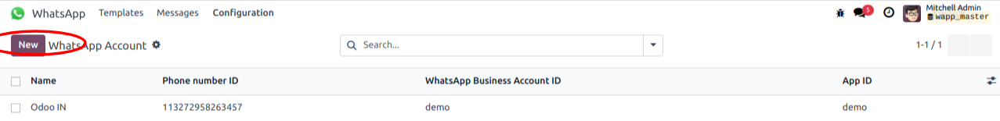
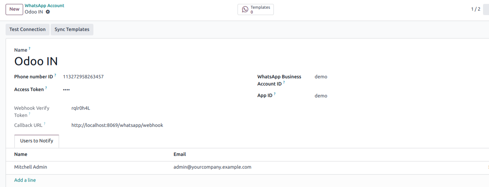
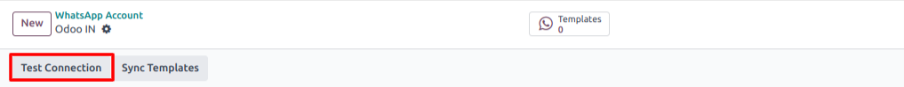
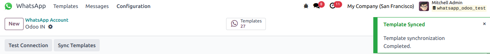
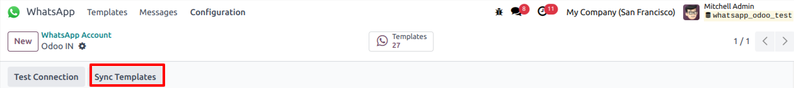
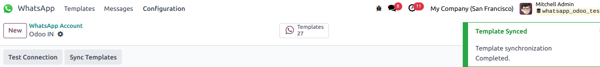
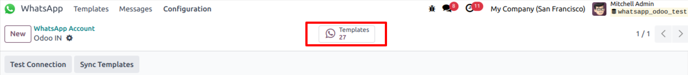

===========================================
Add Your WhatsApp Bussiness Account in Odoo
===========================================

To add your WhatsApp Bussiness Account To Odoo database Go to :menuselection:`Whatsapp --> Configuration --> Accounts`. Here you can simply add your whatsapp account
by clicking on :guilabel:`NEW` adding credentials such as phone number ID and access token.

It will ask some basic information regarding your WhatsApp Bussiness Account.

- :guilabel:`Name`: User can give any convenient name to WhatsApp Account. It will be helpful for user to identify in case of multiple WhatsApp Account.
- :guilabel:`Phone Number Id`: Here user needs to provide Phone number id Which user got from the :guilabel:`Meta Whatsapp API`.
- :guilabel:`Access Token`: Here also user needs to enter access token from the the :guilabel:`Meta Whatsapp API`.
- :guilabel:`Callback URL And Webhook Verify Token` : This will be computed by Odoo. user will require this value for the verification of the web-hook on :guilabel:`Meta Whatsapp API`.
- :guilabel:`WhatsApp Business Account ID` : User needs to enter the business account id from the :guilabel:`Meta Whatsapp API` credentials.
- :guilabel:`App ID`: App Id will be required for the communication between Odoo and :guilabel:`Meta Whatsapp API`.
- :guilabel:`Users To Notify`: Under this tab user can enter the list of user. these list of users will be notified if there is any further developement in communication to this :guilabel:`Phone number Id`.

After Entering all the above information user can click on the Button :guilabel:`Test Connection`.

It will check with the Meta Whatsapp API whether the entered details are correct or not.
If everything is correct then it will display the message given as below.

By clicking on the button :guilabel:`Sync Template`, user can fetch all the created whatsapp template on their
WhatsApp Bussiness Account.

After clicking on :guilabel:`Sync Template`, User will be displayed notification of successful synchronization of whatsapp template on the
top right corner like shown below.

Once user synchronizes Whatsapp Template Succesfully, user will be able to see Whatsapp Templates associated with the current Whatspp Account by clicking
on the stat button :guilabel:`Templates`.

