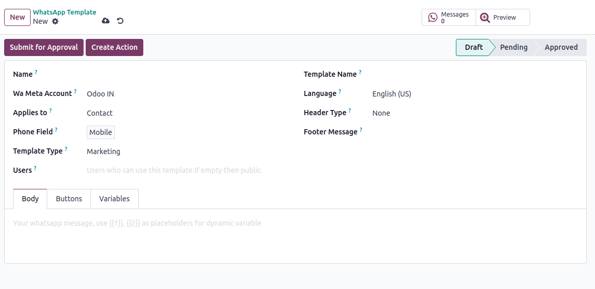
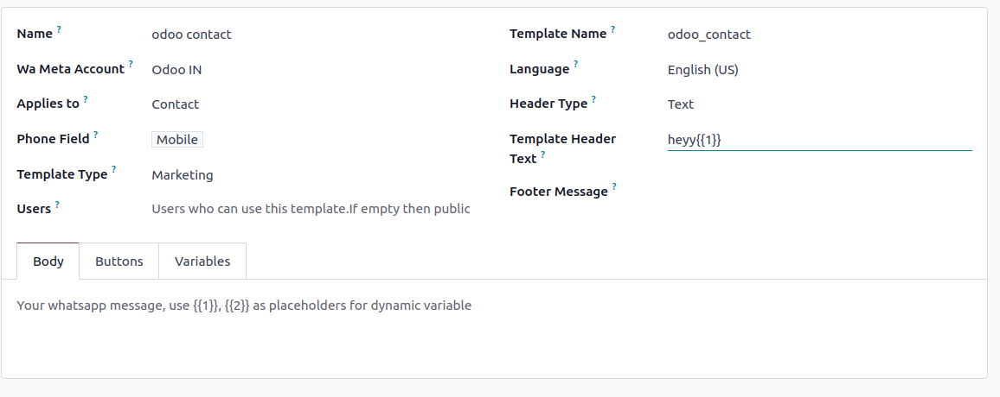
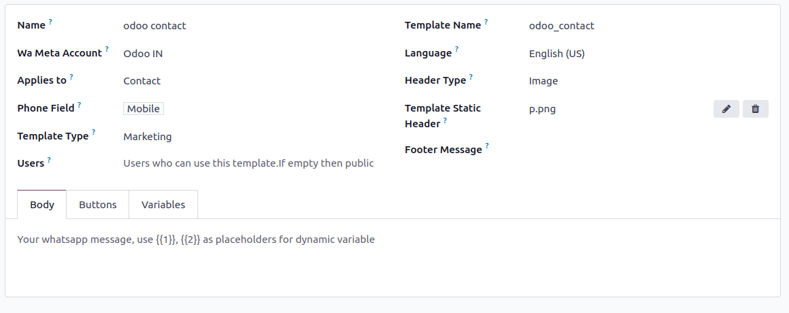
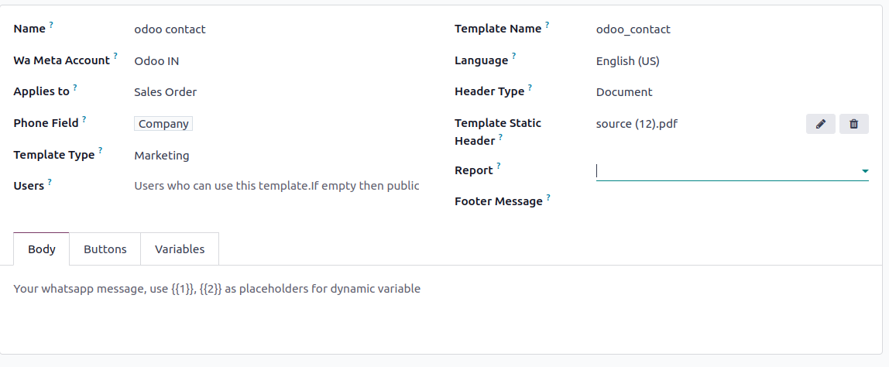
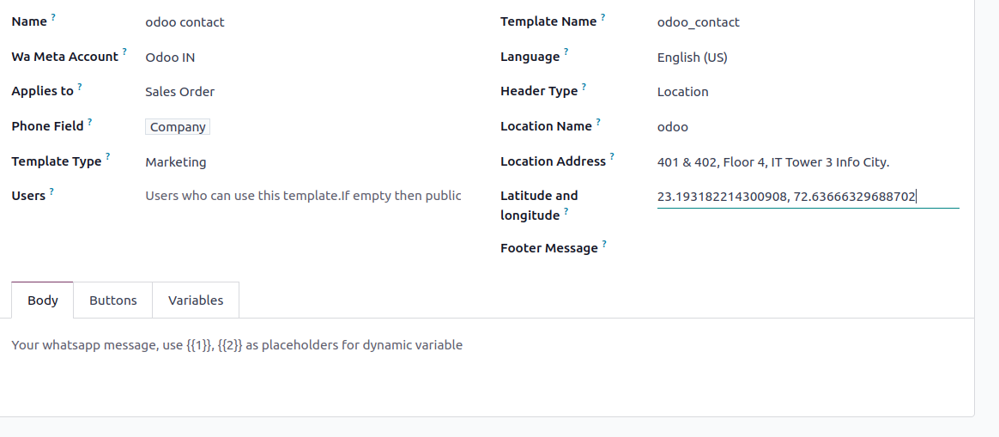
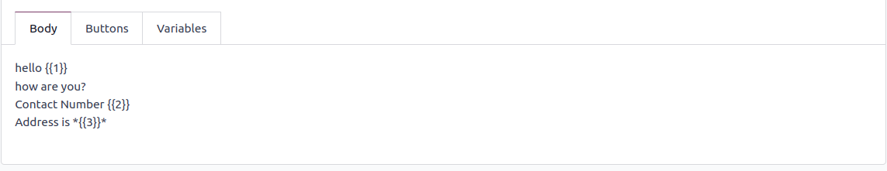
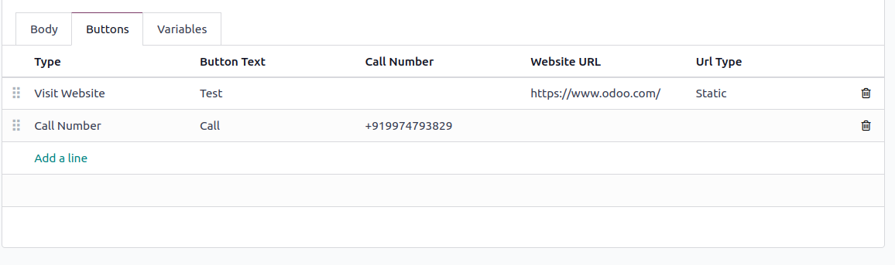
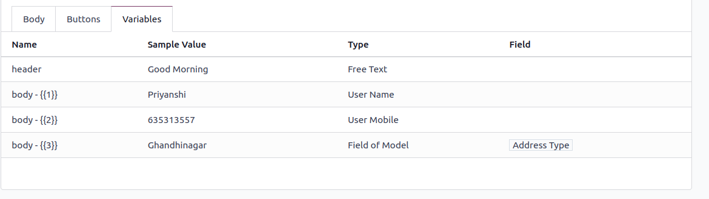

=========================
Get Started with WhatsApp
=========================

Go to :menuselection:`Whatsapp --> Template`. Here you can simply add your whatsapp Template.
by clicking on :guilabel:`NEW` adding credentials such as name, header type , footer message and many more fields.

.. image:: account_configuration/new_template_create.png
   :align: center
   :alt: Add Whatsapp Account in Odoo

Template Configuration
-----------------------

It will ask some basic information.

:guilabel:`Name Field`: This field is used to specify the name or title of the WhatsApp template. It helps identify the type or purpose of the template.

:guilabel:`Applies To Field`: The "Applies To" field is used to determine which module of the template is applied to.

:guilabel:`Phone Fields`:  It is a field selector which can store any fields which can store the phone number

:guilabel:`Template Type`: There are 3 types of template type
1 Authentication 2 Marketing 3 Utility

:guilabel:`Users`:If we do not select any specific users, the system will automatically choose public users.

:guilabel:`Language Field`: The "Language" field is used to specify the language in which the WhatsApp template is written. It ensures that the message is sent in the appropriate language for the recipient.

:guilabel:`Template Name`: The template name is automatically generated when the stage is set to Draft and cannot be modified once created.

:guilabel:`Header Type Field`: This field determines the type of header used in the WhatsApp template. There are :guilabel:`five` possible options:

1.Text: The header consists of a text message. Only one variable is used within the header, or no variables at all.

2.Image: The header includes an image, which must be in JPEG or PNG format.
3.Video: The header includes a video, which can be in either MP4 or 3GP format.

4.Documents: there are two types available : :guilabel:`Static Template Header and Report`.

5.Location: If the template includes location information, there are :guilabel:`three` fields:

Location Name: This field is used to specify the name or title of the location.

Location Address: Here, you can provide the address of the particular location.

Latitude and Longitude: These two values together enable the identification of specific points or places on the globe.

:guilabel:`Footer Message Field`: The "Footer Message" field describes the text that appears in the footer of the WhatsApp template preview section. It can contain additional information or a closing message.

WhatsApp Message View
---------------------

:guilabel:`Body`:In the body page of a WhatsApp template, you write the content that will be displayed to the recipient. Within this content, variables can be used.
 Variables are represented by such as {{1}}, {{2}}, and so on.

:guilabel:`Buttons`:In the button page of the template, there are :guilabel:`three types` of buttons available:

Visit Website: This button allows the recipient to visit a website directly. There are :guilabel:`two types` of Visit Website buttons:

1.Static: A static Website leads to the same website for all recipients who receive the template.

2.Dynamic: A dynamic website provides a dynamically generated link

call Number: This button enables the recipient to make a direct call from within the WhatsApp preview section. When clicked, it initiates a phone call to the specified number.

Quick Reply: Quick Reply are used predefined responses or quick replies.

:guilabel:`Variables`:In the variable page of a WhatsApp template, you can define variables that are used within the body,header or button of the template.

Name: The name field is automatically displayed.

Sample Value: The sample value field is where you can provide an example value based on the variable type.

Type Field: The type field allows you to specify the type of data that the variable represents. There are :guilabel:`five` different types available:

1.User Name: This type is used to display the user name of the current user who receives the template.

2.User Mobile: This type is used to display the phone number of the current user who receives the template.

3.Free Text: With this type, you can enter any text value, and it will be displayed in the WhatsApp Message. It allows for custom messages or information.

4.Portal Link: This type is used when you want to include a link to a specific portal or website. It enables dynamic linking within the template.

5.Fields of Model: This type allows you to reference fields or variables from a specific data model.

