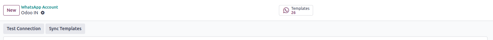
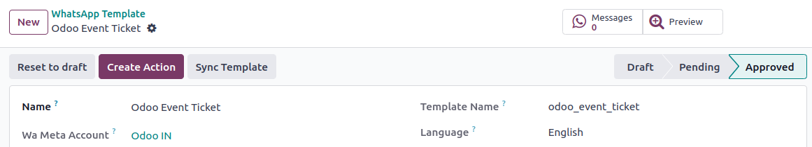

=============
Sync Template
=============

Multiple Sync Template
-----------------------

When you click on the :guilabel:`"Sync Template"` button, All the templates that share the same WhatsApp Business Account ID loads them into the system. 
Once these templates will be available for view in the "Templates" section.

.. image:: template_sync/sync_template.png
   :align: center
   :alt: View of the Multiple Sync Template in Odoo whatsapp

After clicking the "Sync Template" button, the system loads and displays the number of synchronized templates in the state button.

single sync template
---------------------

When you click the "Sync Template" button, the data for a single template is synchronized

